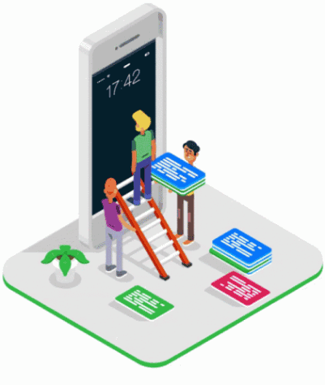

## Hello World, I'm Rasel

&nbsp;&nbsp;

## I'm a Student, Softwere Enginner, and Developer!!

- ✍ You can find my projects here [portfolio]

- 🔭 I’m currently working on Recipe App Api

- 🌱 I’m currently learning Django Rest Framework

- 👯 I’m looking to collaborate on open source

- 💬 Ask me about ... Anything

- 😄 Pronouns: He/His

- ⚡ Fun fact: I speak 4 languages ( English, Bangla, Hindi, Urdu)

### Talk with me, I am kinda awesome:
---
&nbsp;&nbsp;&nbsp;
&nbsp;&nbsp;&nbsp;
&nbsp;&nbsp;&nbsp;
&nbsp;&nbsp;&nbsp;
&nbsp;&nbsp;&nbsp;
&nbsp;&nbsp;&nbsp;

 

### Languages and Tools:
---
&nbsp;&nbsp;&nbsp;
&nbsp;&nbsp;&nbsp;
&nbsp;&nbsp;&nbsp;
&nbsp;&nbsp;&nbsp;
&nbsp;&nbsp;&nbsp;
&nbsp;&nbsp;&nbsp;
&nbsp;&nbsp;&nbsp;
&nbsp;&nbsp;&nbsp;
&nbsp;&nbsp;&nbsp;
&nbsp;&nbsp;&nbsp;
&nbsp;&nbsp;&nbsp;
&nbsp;&nbsp;&nbsp;
&nbsp;&nbsp;&nbsp;
&nbsp;&nbsp;&nbsp;
&nbsp;&nbsp;&nbsp;
&nbsp;&nbsp;&nbsp;&nbsp;
&nbsp;&nbsp;&nbsp;
&nbsp;&nbsp;&nbsp;

 
 

### GitHub Stats & Most Used Languages:
---

  
  
  

[portfolio]: https://github.com/pm-raselalmamun
